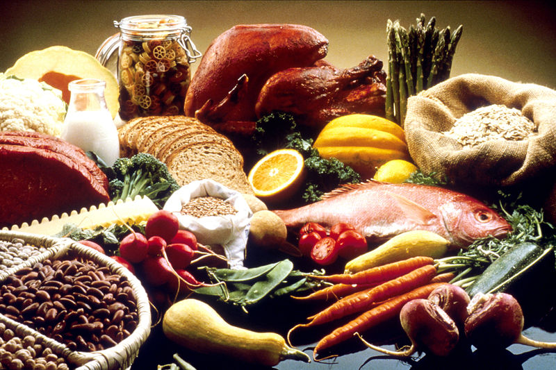

<!--
author:   EPISD SS 2018

email:    LiaScript@web.de

version:  0.0.1

language: en

narrator: US English Female

comment:  Healthy Literacy for Teens is a middle school resource developed by Stanford University and donated to CK-12 Foundation. This FlexBook is intended to teach teenagers about their bodies and ways to maintain a healthy lifestyle. It complements and supplements CK-12's Life Science Concepts and has been aligned with CK-12 Life Science and Biology Concepts. Check out CK-12 concepts for additional information on these important topics.

logo:     ../cover.jpg

tags:      science, Life Science, health, middle school, human biology, biology

-->

# Teen Health Literacy

> This document was automatically translated to LiaScript from
>
> https://www.ck12.org/book/teen-health-literacy/

## 1.0 Introduction

<article>

</article>

### 1.1 Lessons

<article>

1.  Nutrition
2.  Physical Activity/Exercise
3.  Healthy Weight
4.  Sleep
5.  Tobacco Use
6.  Alcohol and Drug Abuse
7.  Sex Education

</article>

### 1.2 Summary

<article>

**Health Literacy for Teens** discusses seven themes important to staying healthy. These include maintaining a proper weight and diet, as well as getting the proper amount of physical activity. Topics discussed also include the importance of sleep, and the dangers of tobacco use and alcohol abuse. The course finishes with a discussion of sex education.

</article>

## 2.0 Nutrition

<article>

</article>

### 2.1 Objectives

<article>

* Explain why we need food.
* Describe the roles of carbohydrates, fats, and proteins.
* Explain why we need water to survive.
* Describe the functions of various vitamins and minerals.
* Discuss the importance of choosing healthy foods.
* List the components of the human digestive system.
* Explain the roles of the organs of the digestive system.

</article>

### 2.2 Nutrition

<article>

The first video provides an introduction to nutrition: http://www.youtube.com/watch?v=OIboFzOIijI (1:20).

!?[0](https://www.youtube.com/watch?v=OIboFzOIijI)

1.  What is the most important requirement for life?
2.  Why do our cells need energy?
3.  Where does our energy come from?

Carbohydrates, Proteins and Fats
--------------------------------

The second video is an overview of carbohydrates, proteins and fats: http://www.youtube.com/watch?v=jqrVl4V5ttQ (9:08).

!?[0](https://www.youtube.com/watch?v=jqrVl4V5ttQ)

1.  What are the 3 basic food nutrients?
2.  How many Calories are needed by an average 8_th_ grade student each day?
3.  Give an example of a monosaccharide.
4.  What is a complex carbohydrate?
5.  Why do you need to eat carbohydrates?
6.  What is a lipid? List three roles of lipids.
7.  Compare saturated fats to unsaturated fats.
8.  List three roles of proteins.
9.  What is an essential amino acid?
10. List five protein-rich foods.
11. Why is fish good for you to eat?

**Associated CK-12 Life Science Concepts**

* _Food and Nutrients_: http://www.ck12.org/life-science/Food-and-Nutrients-in-Life-Science/lesson/Food-and-Nutrients-Basic/
* _Organic Compounds_: http://www.ck12.org/life-science/Organic-Compounds-in-Life-Science/lesson/Organic-Compounds/

Water, Vitamins, Minerals and Fiber
-----------------------------------

The third video is an overview of water, vitamins, minerals and fiber, and their importance to human health: http://www.youtube.com/watch?v=uB5xg28Xyks (5:18).

!?[0](https://www.youtube.com/watch?v=uB5xg28Xyks)

1.  Why do we need to drink water?
2.  How much water do we need each day?
3.  Why do we need vitamins and minerals?
4.  What are three good sources of vitamins?
5.  What are three important minerals that the body needs?
6.  What are two good sources of minerals?
7.  Why is fiber important to our health?
8.  What are three good sources of fiber?

**Associated CK-12 Life Science Concepts**

* _Choosing Healthy Foods_: http://www.ck12.org/life-science/Choosing-Healthy-Foods-in-Life-Science/lesson/Choosing-Healthy-Foods/
* _Vitamins and Minerals_: http://www.ck12.org/life-science/Vitamins-and-Minerals-in-Life-Science/lesson/Vitamins-and-Minerals/

The Digestive System
--------------------

The fourth video is an overview of the digestive system: http://www.youtube.com/watch?v=9rNZS2eYEjo (2:49).

!?[0](https://www.youtube.com/watch?v=9rNZS2eYEjo)

1.  List the functions of the digestive system.
2.  What parts of the digestive process occur in the mouth?
3.  What is peristalsis?
4.  What is the role of gastric acid?
5.  What is meant by absorption?
6.  What occurs in the large intestine?
7.  What is the last part of the digestive system?

**Associated CK-12 Life Science Concepts**

* _Digestive System Organs_: http://www.ck12.org/life-science/Digestive-System-Organs-in-Life-Science/lesson/Digestive-System-Organs-Basic/
* _Human Digestive System_: http://www.ck12.org/life-science/Human-Digestive-System-in-Life-Science/lesson/Human-Digestive-System/

Vocabulary
----------

* **absorption**: Process that allows nutrients to be taken up by the blood.

* **amino acid**: Small molecule used to build proteins.

* **calorie**: The approximate amount of energy needed to raise the temperature of one gram of water by one degree Celsius.

* **carbohydrate**: Organic compound, such as sugar and starch, that provides an energy source for animals.

* **chemical digestion**: Process by which large food molecules are broken down into small nutrient molecules through a chemical process.

* **digestive system**: Body system that breaks down food, absorbs nutrients, and rids the body of solid food waste.

* **fiber**: Carbohydrate that is partially indigestible.

* **lipid**: Organic compound that is insoluble in water and includes fats, oils, and waxes.

* **mechanical digestion**: Process by which large chunks of food are broken down into small pieces through a physical process, such as chewing.

* **mineral**: Chemical element, such as calcium or potassium, that is needed for body processes.

* **nutrient**: Chemical in food that your body needs.

* **peristalsis**: Muscle contractions that help food move through the digestive system.

* **protein**: Organic compound composed of amino acids and includes enzymes, antibodies, and muscle fibers.

* **vitamin**: Organic compound needed in small amounts for the body to function properly.

Summary
-------

* The body needs water and energy to survive.
* Energy comes from carbohydrates, proteins and fats that are eaten.
* Energy is expressed in calories. The average eighth grade student needs 2,000C each day.
* Sugars are simple carbohydrates. Simple carbohydrates provide quick energy.
* Starch is a complex carbohydrate. They provide longer lasting energy.
* Fats provide up to twice the energy of other nutrients.
* Bad fats can be very unhealthy.
* Proteins are the _building blocks of life_.
* Some amino acids must come from food.
* Water provides many essential functions in the body.
* Vitamins and minerals are necessary for the body to function optimally.
* The digestive system breaks down food, absorbs nutrients, and excretes waste.

Review
------

1.  "You are what you eat." What is meant by this phase?
2.  What is a nutrient?
3.  What are carbohydrates, proteins and fats?
4.  Why are unsaturated fats better than saturated fats?
5.  Why are vitamins and minerals important?
6.  Describe the main organs of the digestive function.

</article>

## 3.0 Physical Activity/Exercise

<article>

</article>

### 3.1 Objectives

<article>

* Describe the benefits of an active lifestyle.
* Distinguish between aerobic and anaerobic activity.
* Describe the cardiovascular system and its functions.

</article>

### 3.2 Physical Activity/Exercise

<article>

Types of Exercise
-----------------

The first video describes physical activity important for teenagers: http://www.youtube.com/watch?v=6Gh9Mh2PB8A (4:50).

!?[0](https://www.youtube.com/watch?v=6Gh9Mh2PB8A)

1.  What are the benefits of physical activity?
2.  What comes to your mind when you think of exercise?
3.  Distinguish between aerobic and anaerobic exercises.
4.  List three beneficial aerobic exercises?
5.  What is an anaerobic activity?
6.  Why are anaerobic exercises important?

**Associated CK-12 Life Science Concepts**

* _Fermentation_: http://www.ck12.org/life-science/Fermentation-in-Life-Science/lesson/Fermentation-Basic/
* _Muscles and Exercise_: http://www.ck12.org/life-science/Muscles-and-Exercise-in-Life-Science/lesson/Muscles-and-Exercise/

The Cardiovascular System
-------------------------

The second video is an introduction to the cardiovascular system: http://www.youtube.com/watch?v=vkvhFxcZshQ (4:14).

!?[0](https://www.youtube.com/watch?v=vkvhFxcZshQ)

1.  What is the role of the cardiovascular system?
2.  Why are the lungs included as part of the cardiovascular system in this video?
3.  Describe the structure of the heart.
4.  What is the systemic circulation?
5.  Distinguish between arteries and veins.
6.  What is the pulmonary circulation?
7.  What is the role of blood?

(_\*_Please note that many Life Science resources include the lungs as part of the respiratory system.)

**Associated CK-12 Life Science Concepts**

* _Blood Vessels_: http://www.ck12.org/life-science/Blood-Vessels-in-Life-Science/lesson/Blood-Vessels-Basic/

* _Cardiovascular System_: http://www.ck12.org/life-science/Cardiovascular-System-in-Life-Science/lesson/Cardiovascular-System/

* _Components of Blood_: http://www.ck12.org/life-science/Components-of-Blood-in-Life-Science/lesson/Components-of-Blood/

* _Heart_: http://authors2.ck12.org/wiki/index.php/The_Heart

* _Processes of Breathing_: http://www.ck12.org/life-science/Processes-of-Breathing-in-Life-Science/lesson/Processes-of-Breathing-Basic/

Vocabulary
----------

* **aerobic exercise**: Activity that increases muscular endurance and cardiovascular health.

* **alveoli**: Tiny sacs in the lungs where gas exchange takes place.

* **anaerobic exercise**: Activity that increases muscle strength.

* **artery**: Blood vessel that carries blood away from the heart toward the lungs or body.

* **capillary**: Smallest type of blood vessel that connects very small arteries and veins.

* **cardiovascular system**: Organs involved in circulating blood and lymph through the body, including the heart, blood vessels, and the blood.

* **lactic acid**: A waste product of lactic acid fermentation (anaerobic respiration).

* **muscular endurance**: Ability of a muscle to do continuous work over a long period of time.

* **muscular strength**: Amount of force that your muscles can exert against resistance.

* **platelet**: Cell fragment in blood that helps blood clot.

* **pulmonary circulation**: Part of the circulatory system that carries blood between the heart and lungs.

* **red blood cell**: Type of cell in blood that carries oxygen.

* **systemic circulation**: Part of the circulatory system that carries blood between the heart and body.

* **white blood cell**: Type of cell in blood that defends the body against infection.

* **vein**: Blood vessel that carries blood toward the heart from the lungs or body.

Summary
-------

* Physical activity is important for maintaining a healthy lifestyle.
* Aerobic activity strengthens the cardiovascular system.
* Anaerobic activity strengthens the muscular system, which benefits the overall homeostasis of the body.
* The cardiovascular system delivers oxygenated blood throughout the body.
* Oxygen is transferred into the blood in the lungs. Carbon dioxide is also removed from the blood in the lungs.

Review
------

1.  Why is physical activity important for a healthy lifestyle?
2.  What is the minimum amount of exercise that is recommended to stay healthy?
3.  What is the role of the cardiovascular system?

</article>

## 4.0 Healthy Weight

<article>

</article>

### 4.1 Objectives

<article>

* Understand the importance of maintaining a healthy weight.
* Understand the importance of eating a balanced diet.
* Discuss eating disorders, their causes, and their consequences.

</article>

### 4.2 Healthy Weight

<article>

What's a Healthy Weight?
------------------------

The first video discusses the meaning of a healthy weight: http://www.youtube.com/watch?v=ivIljQNAwKs (7:08).

!?[0](https://www.youtube.com/watch?v=ivIljQNAwKs)

(At the 6:27 mark of the video, the term "cardiac output" should be replaced by "caloric output").

1.  What does the term "healthy weight" mean?
2.  What determines the healthy weight of an individual?
3.  What is a person's metabolic rate?
4.  What is the BMI?
5.  What is meant by energy balance?
6.  What is a balanced diet?
7.  Why is skipping meals not a good idea?
8.  What is a BMR?
9.  How is caloric output increased?

**Associated CK-12 Life Science Concept**

* _Choosing Healthy Foods_: http://www.ck12.org/life-science/Choosing-Healthy-Foods-in-Life-Science/lesson/Choosing-Healthy-Foods/

**Associated Link**

* _What's your BMI?_: http://fit.webmd.com/teen/bmi/calc-bmi

Diet and Obesity
----------------

The second video discusses a balanced diet and the effects of an unbalanced diet: http://www.youtube.com/watch?v=wfUbIpzJK4c (3:43).

!?[0](https://www.youtube.com/watch?v=wfUbIpzJK4c)

1.  What is the key to a good diet?
2.  What is missing from a purely vegetarian diet?
3.  Why do people become overweight or obese?
4.  What is meant by "lifestyle changes?"

**Associated CK-12 Life Science Concept**

* _Choosing Healthy Foods_: http://www.ck12.org/life-science/Choosing-Healthy-Foods-in-Life-Science/lesson/Choosing-Healthy-Foods/

Eating Disorders
----------------

The third video is an overview of eating disorders: http://www.youtube.com/watch?v=GKcO93zBVwQ (6:17).

!?[0](https://www.youtube.com/watch?v=GKcO93zBVwQ)

1.  What causes eating disorders?
2.  Why is important to get help if you have an eating disorder?
3.  What is anorexia nervosa?
4.  What is bulimia?
5.  What is binge eating disorder?
6.  How does body image influence eating?

**Associated CK-12 Biology Concept**

* _Balanced Eating_: http://www.ck12.org/biology/Balanced-Eating/lesson/Balanced-Eating/

Vocabulary
----------

* **balanced eating**: A way of eating that promotes good health.

* **body mass index (BMI)**: An estimate of the fat content of the body.

* **eating disorder**: Mental illness in which people feel compelled to eat in a way that causes physical, mental, and emotional health problems.

* **metabolism**: The sum of all the biochemical reactions in an organism.

* **MyPlate**: Visual guideline for balanced eating; replaced MyPyramid in 2011.

* **obesity**: A condition in which the body mass index is 30.0 kg/m_2_ or greater.

Summary
-------

* Maintaining a healthy weight is important for a healthy lifestyle.
* Healthy weights vary for each individual, and are based on a number of factors.
* Obesity may result from a high caloric intake with little or no physical activity.
* Eating disorders can be very unhealthy.
* People with an eating disorder need professional help.

Review
------

1.  What is healthy weight?
2.  How is a healthy weight maintained?
3.  What is an eating disorder?
4.  What causes eating disorders?

</article>

## 5.0 Sleep

<article>

</article>

### 5.1 Objectives

<article>

* Discuss the importance of sleep.
* Discuss the importance of getting enough sleep and having good sleep habits.
* Describe issues that prevent a good night sleep.

</article>

### 5.2 Sleep

<article>

The Importance of Sleep
-----------------------

The first video provides an overview of the importance of sleep: http://www.youtube.com/watch?v=1XW-q3A20Nc (6:27).

!?[0](https://www.youtube.com/watch?v=1XW-q3A20Nc)

1.  Why do we need to sleep?
2.  How does sleep affect our brains?
3.  What is meant by "rejuvenating our bodies?"
4.  How does sleep affect the levels of growth hormone?
5.  What is a biological clock?
6.  Describe the sleep cycle.
7.  What is REM sleep?

**Associated CK-12 Life Science Concepts**

* _Cyclic Behavior of Animals_: http://www.ck12.org/life-science/Cyclic-Behavior-of-Animals-in-Life-Science/lesson/Cyclic-Behavior-of-Animals-Basic/
* _Nerve Cells and Nerve Impulses_: http://www.ck12.org/life-science/Nerve-Cells-and-Nerve-Impulses-in-Life-Science/lesson/Nerve-Cells-and-Nerve-Impulses/

**Associated CK-12 Biology Concept**

* _Hormones_: http://www.ck12.org/biology/Hormones/lesson/Hormones/

**Associated Link**

* _The Sleep-Memory Connection_: http://www.pbs.org/wgbh/nova/body/sleep-memory.html

Sleep Debt
----------

The second video is an overview of sleep habits: http://www.youtube.com/watch?v=6l6xyVGgkI0 (8:06).

!?[0](https://www.youtube.com/watch?v=6l6xyVGgkI0)

1.  How much sleep does a teenager need?
2.  What is meant by "sleep debt?"
3.  What issues are associated with sleep debt?
4.  What is microsleep?
5.  What are ghrelin and leptin?
6.  What is meant by having good sleep habits?

**Associated CK-12 Life Science Concepts**

* _Enzymes in the Digestive System_: http://www.ck12.org/life-science/Enzymes-in-the-Digestive-System-in-Life-Science/lesson/Enzymes-in-the-Digestive-System/

Sleep Disorders
---------------

The third video discusses sleep disorders and their consequences: http://www.youtube.com/watch?v=svyAUko5l3s (10:02).

!?[0](https://www.youtube.com/watch?v=svyAUko5l3s)

1.  What is a somnipathy?
2.  What causes snoring?
3.  What is sleep apnea?
4.  What are symptoms of sleep apnea?
5.  What causes sleep apnea?
6.  What treatments are available for sleep apnea?
7.  What is insomnia?
8.  What are four factors that cause insomnia?
9.  What is a solution for insomnia?

**Associated CK-12 Life Science Concepts**

* _Respiratory System Organs_: http://www.ck12.org/life-science/Respiratory-System-Organs-in-Life-Science/lesson/Respiratory-System-Organs-Basic/

Vocabulary
----------

* **biological clock**: Structure that controls the activities of an organism whose activities change on a regular 24-hour cycle.

* **circadian rhythm**: Regular change in biology or behavior that occurs in a 24-hour cycle.

* **hormone**: A chemical messenger molecule.

* **neurotransmitter**: Chemical that carries a nerve impulse from one nerve cell to another at the synapse.

* **pharynx**: Long, tubular organ that connects the mouth and nasal cavity with the larynx; food and air pass through it.

* **trachea**: Long, tubular organ, also called the wind pipe, that carries air between the larynx and lungs.

Summary
-------

* Getting a good night sleep is important to staying healthy.
* Accumulating sleep debt or having poor sleep habits can keep you from being your best.
* Sleep disorders can prevent a good nights sleep.

Review
------

1.  Why is sleep important?
2.  Why is getting enough sleep important?
3.  What can prevent a good nights sleep?

</article>

## 6.0 Tobacco Use

<article>

</article>

### 6.1 Objectives

<article>

* Understand the necessity of breathing and the role of oxygen.
* Discuss the harmful effects of smoking.
* Describe how smoking damages the respiratory and cardiovascular systems.

</article>

### 6.2 Tobacco Use

<article>

Breathing and the Respiratory System
------------------------------------

The first video provides an overview of breathing and the respiratory system: http://www.youtube.com/watch?v=qgPMPq3NvfM (5:16).

!?[0](https://www.youtube.com/watch?v=qgPMPq3NvfM)

1.  Why do you need to breath in order to survive?
2.  What is in the air that is important and essential to our bodies?
3.  What is ATP?
4.  What path does air follow in our bodies?
5.  Where is oxygen transferred into the blood?
6.  What is the process of air exchange?
7.  What is hemoglobin?

**Associated CK-12 Life Science Concepts**

* _Cellular Respiration_: http://www.ck12.org/life-science/Cellular-Respiration-in-Life-Science/lesson/Cellular-Respiration-Basic/

* _Components of Blood_: http://www.ck12.org/life-science/Components-of-Blood-in-Life-Science/lesson/Components-of-Blood/

* _Processes of Breathing_: http://www.ck12.org/life-science/Processes-of-Breathing-in-Life-Science/lesson/Processes-of-Breathing-Basic/

* _Process of Cellular Respiration_: http://www.ck12.org/life-science/Process-of-Cellular-Respiration-in-Life-Science/lesson/Process-of-Cellular-Respiration/

* _Respiration_: http://www.ck12.org/life-science/Respiration-in-Life-Science/lesson/Respiration-Basic/

* _Respiratory System Organs_: http://www.ck12.org/life-science/Respiratory-System-Organs-in-Life-Science/lesson/Respiratory-System-Organs-Basic/

What is Smoking
---------------

The second video is an overview of smoking and its harmful effects: http://www.youtube.com/watch?v=p_aI-ug4wgk (7:46).

!?[0](https://www.youtube.com/watch?v=p_aI-ug4wgk)

1.  What is smoking?
2.  What harmful chemicals are found in tobacco products?
3.  Why do people smoke?
4.  Why is it difficult to quit smoking?
5.  What is tar?
6.  What is carbon monoxide?
7.  How does smoking make breathing less efficient?
8.  What is secondhand smoke?

**Associated CK-12 Biology Concept**

* _Drugs and the Nervous System_: http://www.ck12.org/biology/Drugs-and-the-Nervous-System/lesson/Drugs-and-the-Nervous-System/

How Smoking Affects the Respiratory System
------------------------------------------

The third video discusses the effects smoking has on breathing: http://www.youtube.com/watch?v=jAsISg6MFmw (5:16).

!?[0](https://www.youtube.com/watch?v=jAsISg6MFmw)

1.  What are 3 consequences of smoking?
2.  How does smoking damage the windpipe?
3.  How does smoking affect the lungs?
4.  Why might a smoker feel tired more often than a nonsmoker?
5.  Why does smoking damage the cardiovascular system?

**Associated CK-12 Life Science Concepts**

* _Respiratory System Diseases_: http://www.ck12.org/life-science/Respiratory-System-Diseases-in-Life-Science/lesson/Respiratory-System-Diseases-Basic/

* _Respiratory System Health_: http://www.ck12.org/life-science/Respiratory-System-Health-in-Life-Science/lesson/Respiratory-System-Health/

Vocabulary
----------

* **alveoli**: Tiny sacs in the lungs where gas exchange takes place.

* **ATP (adenosine triphosphate)**: Usable form of energy inside the cell.

* **bronchi**: Air passages in the respiratory tract that conduct air into the lungs.

* **cellular respiration**: Process of breaking down glucose to obtain energy in the form of ATP.

* **hemoglobin**: Protein in red blood cells that binds oxygen.

* **larynx**: Respiratory organ between the pharynx and trachea; also called the voice box because it allows the production of vocal sounds.

* **pharynx**: Long, tubular organ that connects the mouth and nasal cavity with the larynx; food and air pass through it.

* **trachea**: Long, tubular organ, also called the wind pipe, that carries air between the larynx and lungs.

Summary
-------

* Oxygen is needed by the cells of the body to produce ATP.
* Oxygen travels to the body cells through the blood.
* Smoking disrupts the amount of oxygen that can travel in the blood.
* Smoking damages both the respiratory and cardiovascular systems.

Review
------

1.  How does oxygen enter the blood?
2.  Why is smoking harmful?

</article>

## 7.0 Alcohol and Drug Abuse

<article>

</article>

### 7.1 Objectives

<article>

* Understand the consequences of drug and alcohol consumption and abuse.
* Understand the basic structure and functions of the nervous system.
* Describe the effects of alcohol and drug abuse on the nervous system.

</article>

### 7.2 Alcohol and Drug Abuse

<article>

At the Party
------------

The first video provides an introduction to issues associated with alcohol and the metabolism of alcohol: http://www.youtube.com/watch?v=wXKeq4XtgOs (5:59).

!?[0](https://www.youtube.com/watch?v=wXKeq4XtgOs)

1.  What is the legal age to consume alcohol?
2.  What happens to alcohol when it enters the digestive system?
3.  What happens to alcohol in the liver?
4.  At what rate is alcohol metabolized?
5.  What is the relationship between drinking alcohol and the BAC?

**Associated CK-12 Life Science Concept**

* _Digestive System Organs_: \[http://www.ck12.org/life-science/Digestive-System-Organs-in-Life-Science/lesson/Digestive-System-Organs-Basic/ http://www.ck12.org/life-science/Digestive-System-Organs-in-Life-Science/lesson/Digestive-System-Organs-Basic/\[

After the Party
---------------

The second video is an overview of the effects of alcohol: http://www.youtube.com/watch?v=6toOBThzfeQ (3:33).

!?[0](https://www.youtube.com/watch?v=6toOBThzfeQ)

1.  What is the legal BAC limit to drive?
2.  What happens when alcohol enters the brain?
3.  What are the bodily consequences of alcohol consumption?
4.  What are the social consequences of alcohol consumption?
5.  What are two tips for legal adult drinking?

**Associated CK-12 Life Science Concept**

* _Central Nervous System_: http://www.ck12.org/life-science/Central-Nervous-System-in-Life-Science/lesson/Central-Nervous-System-Basic/

The Nervous System
------------------

The third video is an introduction to the nervous system: http://www.youtube.com/watch?v=BC9ElQ73fu0 (8:31).

!?[0](https://www.youtube.com/watch?v=BC9ElQ73fu0)

1.  What is meant by the "Command and Communication Center?"
2.  What is a neuron?
3.  What are the major functions of the neuron?
4.  Describe the structure of the neuron.
5.  What are neurotransmitters?
6.  What is the CNS? What does it do?
7.  List the four regions of the brain and their functions.
8.  What is the PNS?
9.  What are nerves?
10. Compare a sensory neuron to a motor neuron.

**Associated CK-12 Life Science Concepts**

* _Central Nervous System_: http://www.ck12.org/life-science/Central-Nervous-System-in-Life-Science/lesson/Central-Nervous-System-Basic/
* _Nervous System_: http://www.ck12.org/life-science/Nervous-System-in-Life-Science/lesson/Nervous-System/
* _Nerve Cells and Nerve Impulses: http://www.ck12.org/life-science/Nerve-Cells-and-Nerve-Impulses-in-Life-Science/lesson/Nerve-Cells-and-Nerve-Impulses/_
* _Peripheral Nervous System_: http://www.ck12.org/life-science/Peripheral-Nervous-System-in-Life-Science/lesson/Peripheral-Nervous-System-Basic/

Drug Abuse
----------

The fourth video is an overview of the dangers of alcohol and drug abuse: http://www.youtube.com/watch?v=cOdyrZeWIN4 (7:37).

!?[0](https://www.youtube.com/watch?v=cOdyrZeWIN4)

1.  Why is alcohol considered to be a depressant?
2.  What is meant by alcohol abuse?
3.  What is drug abuse?
4.  What are recreational drugs? How do they work?
5.  Compare stimulants to relaxants.
6.  What are three effects of marijuana use?
7.  What are three effects of cocaine use?
8.  What are inhalants?
9.  What are potential consequences of mixing drugs?

**Associated CK-12 Biology Concept**

* _Drugs and the Nervous System_: http://www.ck12.org/biology/Drugs-and-the-Nervous-System/lesson/Drugs-and-the-Nervous-System/

Vocabulary
----------

* **axon**: Long, threadlike part of a neuron that transmits nerve impulses to other cells.

* **brain**: Control center of the nervous system.

* **central nervous system**: Main part of the nervous system; includes the brain and spinal cord.

* **dendrite**: Extension of the cell body of a neuron that receives nerve impulses from other neurons.

* **depressant**: Drug that has the opposite effects of a stimulant; makes you less alert.

* **drug abuse**: Use of a drug without the advice of a medical professional and for reasons not originally intended.

* **motor neuron**: Nerve cell that carries nerve impulses from the brain and spinal cord to organs, glands, and muscles.

* **nerve**: Bundle of nerve cells.

* **nerve impulse**: Electrical signal transmitted by the nervous system.

* **nervous system**: Body system that sends electrical messages throughout the body; controls all other body systems.

* **neuron**: Nerve cell.

* **neurotransmitter**: Chemical that carries a nerve impulse from one nerve cell to another at the synapse.

* **sensory neuron**: Nerve cell that carries nerve impulses from the sense organs and internal organs to the brain and spinal cord.

* **spinal cord**: Long, tube-shaped bundle of neurons that runs from the brain stem to the lower back; carries nerve impulses back and forth between the body and brain.

* **stimulant**: Drug that makes you feel more awake and alert.

Summary
-------

* It is illegal to consume alcohol under the age of 21.
* Consuming alcohol increases your BAC.
* Alcohol consumption may have significant bodily and social consequences.
* The nervous system coordinates messages into an emotional, physical or biological response.
* Drug abuse can have serious consequences, including death.

Review
------

1.  What is meant by "beer = wine = whiskey?"
2.  What are the major consequences of alcohol consumption?
3.  What are the main roles of the nervous system?
4.  Give three examples of drug abuse and their consequences.

</article>

## 8.0 Sex Education

<article>

</article>

### 8.1 Objectives

<article>

* Describe changes that occur during puberty.
* Understand the basics of the human reproductive systems.
* Discuss issues associated with teenage pregnancy.
* Understand methods to prevent pregnancy.
* Describe STIs and their dangers.

</article>

### 8.2 Sex Education

<article>

Puberty and Adolescence
-----------------------

The first video serves as an introduction to puberty and adolescence: http://www.youtube.com/watch?v=WYr_Bp53PcQ (6:08).

!?[0](https://www.youtube.com/watch?v=WYr_Bp53PcQ)

1.  Define sexuality.
2.  Define puberty.
3.  What are three signs of puberty in boys?
4.  What are three signs of puberty in girls?
5.  List two non=physical changes that occur during puberty.

**Associated CK-12 Life Science concept**

* _Puberty and Adolescence_: http://www.ck12.org/life-science/Puberty-and-Adolescence-in-Life-Science/lesson/Puberty-and-Adolescence/

Hormones and the Reproductive System
------------------------------------

The second video provides an introduction to hormones and the reproductive systems: http://www.youtube.com/watch?v=mLPPC-ujI2U (8:42).

!?[0](https://www.youtube.com/watch?v=mLPPC-ujI2U)

1.  What are hormones?
2.  What are the main sex hormones?
3.  Describe the roles of the sex hormones.
4.  What is the primary role of the male reproductive system?
5.  What is the primary role of the female reproductive system?
6.  Describe when a females eggs mature.
7.  What is the menstrual period?
8.  What are the four hormones involved in menstruation?
9.  When does ovulation occur?
10. What is a woman's period?

**Associated CK-12 Life Science concepts**

* _Female Reproductive Structures_: http://www.ck12.org/life-science/Female-Reproductive-Structures-in-Life-Science/lesson/Female-Reproductive-Structures-Basic/
* _Female Reproductive System_: http://www.ck12.org/life-science/Female-Reproductive-System-in-Life-Science/lesson/Female-Reproductive-System/
* _Male Reproductive Structures_: http://www.ck12.org/life-science/Male-Reproductive-Structures-in-Life-Science/lesson/Male-Reproductive-Structures-Basic/
* _Male Reproductive System_: http://www.ck12.org/life-science/Male-Reproductive-System-in-Life-Science/lesson/Male-Reproductive-System/
* _Menstrual Cycle_: http://www.ck12.org/life-science/Menstrual-Cycle-in-Life-Science/lesson/Menstrual-Cycle-Basic/

Teen Pregnancy
--------------

The third video discusses issues associated with teenage pregnancy: http://www.youtube.com/watch?v=mJty2cZww_w (7:47).

!?[0](https://www.youtube.com/watch?v=mJty2cZww_w)

1.  Describe the three main phases of pregnancy.
2.  During which days of a 28-day cycle is a female most likely to become pregnant?
3.  Describe three signs of pregnancy.
4.  Why does a woman miss her period when she is pregnant?
5.  How has teen pregnancy been shown to affect the lives of the parents?
6.  What is the only way to truly prevent becoming pregnant?

**Associated CK-12 Life Science concepts**

* _Fertilization_: http://www.ck12.org/life-science/Fertilization-in-Life-Science/lesson/Fertilization-Basic/
* _Pregnancy and Childbirth_: http://www.ck12.org/life-science/Pregnancy-and-Childbirth-in-Life-Science/lesson/Pregnancy-and-Childbirth-Basic/

Contraception
-------------

The fourth video is an introduction to types of contraception: http://www.youtube.com/watch?v=UqJqKp6917I (9:49).

!?[0](https://www.youtube.com/watch?v=UqJqKp6917I)

1.  How can _the pill_ prevent pregnancy?
2.  What is the birth control patch?
3.  How does a condom work?
4.  What is an IUD? How do IUDs work?
5.  What is the morning-after pill?
6.  What contraceptive methods are the most effective?

Sexually Transmitted Infections (STIs)
--------------------------------------

The fifth video is an overview of STIs: http://www.youtube.com/watch?v=pKU2VVTiqAM (8:28).

!?[0](https://www.youtube.com/watch?v=pKU2VVTiqAM)

1.  What is an STI?
2.  How are STIs transmitted?
3.  What are three symptoms of an STI?
4.  How are STIs treated?
5.  List three facts related to chlamydia.
6.  List three facts related to herpes.
7.  List three facts related to HIV/AIDS.
8.  What is "safe sex?"

**Associated CK-12 Life Science concepts**

* _Sexually Transmitted Infections_: http://www.ck12.org/life-science/Sexually-Transmitted-Infections-in-Life-Science/lesson/Sexually-Transmitted-Infections-Basic/

**Associated CK-12 Biology concepts**

* _HIV and AIDS_: http://www.ck12.org/biology/HIV-and-AIDS/lesson/HIV-and-AIDS/
* _Sexually Transmitted Infections_: http://www.ck12.org/biology/Sexually-Transmitted-Infections/lesson/Sexually-Transmitted-Infections/
* _Bacterial Sexually Transmitted Infections_: http://www.ck12.org/biology/Bacterial-Sexually-Transmitted-Infections/lesson/Bacterial-Sexually-Transmitted-Infections/
* _Viral Sexually Transmitted Infections_: http://www.ck12.org/biology/Viral-Sexually-Transmitted-Infections/lesson/Viral-Sexually-Transmitted-Infections/

Vocabulary
----------

* **adolescence**: Period of life between the start of puberty and the beginning of adulthood during which significant physical, mental, emotional, and social changes occur.

* **AIDS (acquired immune deficiency syndrome)**: Disorder characterized by frequent opportunistic infections; eventually develops in people who are infected with human immunodeficiency virus (HIV).

* **estrogen**: Main sex hormone in females

* **fertilization**: Union of the sperm and egg.

* **HIV**: Human immunodeficiency virus; virus that causes AIDS.

* **hormone**: A chemical messenger molecule.

* **implantation**: Process in which an embryo fixes itself into the lining the uterus.

* **menstrual cycle**: Series of changes in the reproductive system of mature females that repeats every month.

* **menstruation**: Process in which blood and other tissues from the lining of the uterus are shed and exit the body.

* **ovary**: Female reproductive organ in which eggs form.

* **ovum**: A female egg cell.

* **puberty**: Stage of life during which a child becomes sexually mature.

* **semen**: Fluid containing the sperm.

* **sexually transmitted infection (STI)**: Infection caused by a pathogen that spreads mainly through sexual contact.

* **testes**: Male reproductive organs that produce sperm and secrete testosterone.

* **testosterone**: Main sex hormone in males.

Summary
-------

* Puberty is a transition from being a child into an adult.
* Sex hormones are responsible for the changes that occur during puberty.
* Issues associated with teenage pregnancy can have dramatic effects on the parents' lives.
* Abstinence is the only way to truly prevent pregnancy.
* STIs are sexually transmitted infections/diseases that can have devastating consequences.
* STIs are preventable.

Review
------

1.  What general changes occur during puberty?
2.  Describe the general roles of the reproductive systems.
3.  How might a woman know when she is pregnant?
4.  Describe three effective contraceptive methods.
5.  What are STIs? How can they be prevented?

</article>

